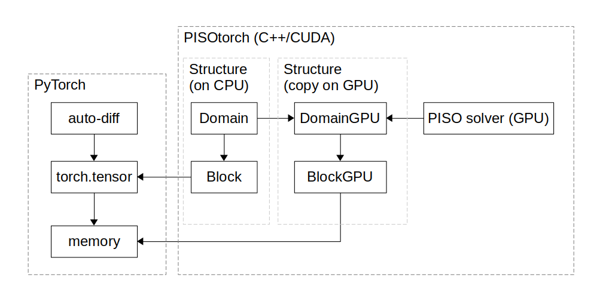

# Official Repository of the PICT Solver

Source code of the paper *PICT - A Differentiable, GPU-Accelerated Multi-Block PISO Solver for Simulation-Coupled Learning Tasks in Fluid Dynamics*:  
[arXiv preprint](https://arxiv.org/abs/2505.16992)  
[Preprint](https://ge.in.tum.de/download/PICT-preprint.pdf)  

Highlights:
- Validated 2nd-order PISO solver with flexible, deformed multi-block domains
- Seamless AI, deep learning, and neural network integration via PyTorch
- Fully differentiable
- Modular CUDA operators for efficient simulation at training and inference time

[Feel free to also check out the other work of our lab :)](https://ge.in.tum.de/publications/)

## Setup

The PICT solver and CUDA toolkit is installed via conda, pytorch via pip:
- Install miniconda  
- Create the environment using the `environment.txt` from the repo:  
`conda create --name pisotorch --file environment.txt`  
- Then activate with `conda activate pisotorch`  
- Make sure that a recent version of python 3.10 is installed via `python --version`.  
- Install the latest Pytorch for CUDA 12.8 via pip `pip3 install torch torchvision torchaudio --index-url https://download.pytorch.org/whl/cu128`  
- Install the matching cuda toolkit via conda `conda install cuda-toolkit=12.8 -c nvidia/label/cuda-12.8.1`  

To compile the custom CUDA kernels  
```
cd extensions
python setup.py install
```

You can use `python run_tests.py` to test the compiled kernels. The tests are extensive, this can take ca. 30 minutes.
Set `os.environ["CUDA_VISIBLE_DEVICES"]="3"` to an available GPU on your machine (use `nvidia-smi` to check GPU usage).
(Note: As of April 2025, around 5 tests fail at the moment, but most of them should work.)

### Notes on Versions
PICT uses python 3.10.x by default. If you want to use another python version, you have to change it in `environment.txt` before setting up the environment.  
PICT should work for different PyTorch versions with either CUDA 11 or 12. It was successfully tested with:
- PyTorch 1.13 and CUDA 11.8
- PyTorch 2.6 and CUDA 11.8
- PyTorch 2.7 and CUDA 11.8
- PyTorch 2.7 and CUDA 12.8

To install, e.g., PyTorch 2.6 with CUDA 11.8, the last two steps of the setup become:
- `pip3 install torch==2.6.0 torchvision==0.21.0 torchaudio==2.6.0 --index-url https://download.pytorch.org/whl/cu118`
- `conda install cuda-toolkit=11.8 -c nvidia/label/cuda-11.8.0`


## Examples

We provide a few sample setup with extensive comments about simulation setup.
For forward simulations `minimal_lid_sample.py`, `vortex_street_torus_sample.py`, and `test_airfoil.py` contain increasingly complex setups.
For a learning setup `learning_sample.py` contains an example of learning a forcing term from a reference simulation, both with direct optimization and training a network.

## Overview of the PICT System

- Differentiable fluid simulation using the PISO algorithm.
- Support for multi-block grids and transformations of regular grids (i.e. curvilinear grids).
- Connection to PyTorch to support learning/gradients, including a multi-block convolution.

Memory uses `torch.tensor`.
Multi-block setup: a full setup is contained within a `Domain`. The `Domain` contains multiple `Blocks` that each have `Boundaries` and connections to each other.
A `Block` is a containter for a (possibly transformed) regular grid containing fluid velocities, pressure, and optionally passive scalars. These quantities are stored in `torch.tensor`s.
The `Domain` with its `Block`s gives the structural information about the fluid sim setup and holds references to the `torch.tensor`s that hold the actual simulation state.  
For simulation with the `PISOtorch` module, the structural information from the `Domain` is packed and copied to the GPU using the (internal) `DomainGPU` and `BlockGPU` structures.
These now contain raw memory pointers to the memory underlying the `torch.tensor` objects. Each step in the simulation overwrites this memory with its result, unless the differentiable mode is used.

The relation is shown here:


This setup means that: Pytorch has no idea about the Domain-Block setup or the simulation, and the GPU simulation is oblivious to the Pytorch side.  
Due to this, the `PISOtorch_diff` wrapper exists that replaces the tensors held by `Domain` and `Block` in each step to keep the computational graph of `torch.tensor` for auto-diff intact.

## Setup Info and Troubleshooting

The environment setup should contain all tools and libraries of compatible versions, including nvcc and gcc compilers.
Versions matter and have to be compatible:
- torch packages are install for a specific python version
- torch version needs a specific cuda version
- cuda version dictates nvcc and cuda library versions
- linear solver implementations need specific cuda library versions
- nvcc sets limitations on gcc version  

In the current setup this means torch 2.7, cuda (runtime, nvcc, libraries) 12.8, gcc 6.0 to 11.5.
If you want to update torch to a newer cuda version, the cuda version(s) might have to be updated accordingly, which in turn might require the solver implementation to be updated to use newer library functions.

**GCC** The conda installed gcc will not supercede the system installed gcc, but will have a different name like `x86_64-conda-linux-gnu-cc` that should be set in the `CC` environment variable. It should be used automatically when running `setup.py`.

**Sysconfig** sometimes with older python version the `_sysconfigdata_x86_64_conda_cos7_linux_gnu.py` file needed for building the cuda kernels was not generated. This might be due to a python 3.9.x version that is too low.  
For the issues observed so far (`cos7` required but only `cos6` available) a workaround is to simply replace `cos6` with `cos7` in the file and filename (make a copy).  
The file should be in `$CONDA_PREFIX/lib/python3.7` with `$CONDA_PREFIX` being something like `~/miniconda3/envs/pisotorch`. E.g.:
`cd /home/xxx/miniconda3/envs/pict/lib/python3.9/ ; mv _sysconfigdata_x86_64_conda_cos6_linux_gnu.py _sysconfigdata_x86_64_conda_cos7_linux_gnu.py`

**Dynamic Linker** might not find required libraries (or specific versions), which expresses itself as a file-not-found error.  
1. make sure that the linker find the libraries in the environment by setting ``.
	```
	export LD_LIBRARY_PATH=$CONDA_PREFIX/lib:${LD_LIBRARY_PATH}
	```
2. if the issue persists the required library is missing from the environment setup.  

To automate step 1. for the environment you can add to the file `env_vars.sh` (create it if missing) in `$CONDA_PREFIX/etc/conda/activate.d`:
```
export OLD_LD_LIBRARY_PATH=${LD_LIBRARY_PATH}
export LD_LIBRARY_PATH=$CONDA_PREFIX/lib:${LD_LIBRARY_PATH}
```
and to the same file in `$CONDA_PREFIX/etc/conda/deactivate.d`:
```
export LD_LIBRARY_PATH=${OLD_LD_LIBRARY_PATH}
unset OLD_LD_LIBRARY_PATH
```

